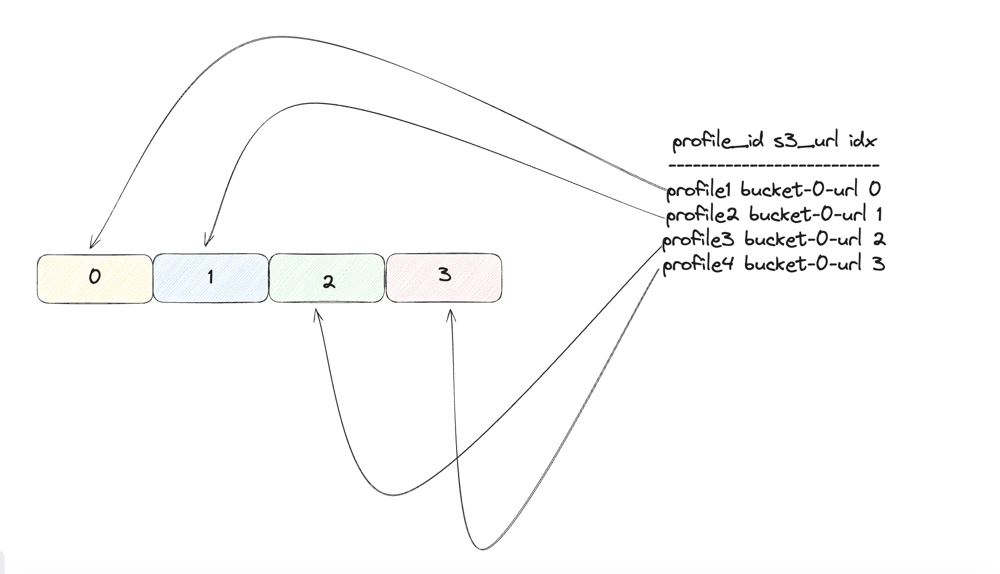

# What?!

Simple! Just merge multiple pprof profiles into a single one 

## Why?

Very useful in cases when you need to store your profiles in raw format in some object storage (s3 for instance). 
As number of profiles grows, the storage requirements do as well. 

There's already a way to represent several profiles in a compact way by just using
Merge function in pprof package, but the latter doesn't offer ability to recover any of the 
input profiles. 

## How it works?

In order to understand how merger works, we need to dig a bit deeper into a profile structure

```go
// Profile is an in-memory representation of profile.proto.
type Profile struct {
	SampleType        []*ValueType
	DefaultSampleType string
	Sample            []*Sample
	Mapping           []*Mapping
	Location          []*Location
	Function          []*Function
	Comments          []string

	DropFrames string
	KeepFrames string

	TimeNanos     int64
	DurationNanos int64
	PeriodType    *ValueType
	Period        int64

	// The following fields are modified during encoding and copying,
	// so are protected by a Mutex.
	encodeMu sync.Mutex

	commentX           []int64
	dropFramesX        int64
	keepFramesX        int64
	stringTable        []string
	defaultSampleTypeX int64
}
```

In this profile, we have a metadata, such as functions, mappings, and locations and 
actual data, such as samples. Samples represent actual values, which can mean different things depending on 
sample type, i.e. number of allocations, cpu nanoseconds, etc....

Now let's get to the merging process. In the very beginning we could merge profiles into a single one 
ignoring any compaction-related optimizations, but it would be pointless if our end goal is to save some space. 

First of all, if one examines samples one will notice that instead of storing slice of ids to locations they store the slice of locations. 
Storing ids makes more sense, as we can easily recover initial profile by consulting "metadata storage" inside our merged profile. 

Second optimization was targeted towards efficient storage of strings. All strings were replaced by integer references to string table, which 
is stored as a slice. 

Third optimization consisted in eliminating unused metadata. During merge process algorithm stores only metadata that samples have reference to.

## API 
One example needed to describe it

```go
package main 

import (
	"github.com/threadedstream/ppmerge"
	"github.com/google/pprof/profile"
)

func main(){
	var profiles []*profile.Profile
	paths := []string{""} // your profiles

	for _, profileName := range paths {
		file, err := os.OpenFile(profileName, os.O_RDONLY, 0666)
		if err != nil {
			log.Fatal(err)
		}

		prof, err := profile.Parse(file)
		if err != nil {
			log.Fatal(err)
		}

		profiles = append(profiles, prof)
	}

	profileMerger := ppmerge.NewProfileMerger()
	// merge profiles
	mergedProfile := profileMerger.Merge(profiles...)
	unpacker := ppmerge.NewProfileUnPacker(mergedProfile)
	// unpack profile
	recoveredProf, err := unpacker.Unpack(0)
	if err != nil {
		log.Fatal(err)
	}
	/// do something with recoveredProf
}
```

## How to recover profiles

It is assumed that you "remember" the order profiles were passed to merge function. 
If you have additional storage like PostgreSQL or Clickhouse to store profiles' metadata, you can follow the scheme below


## Space optimization
Unlike pprof.Merge, this merge algorithm is able to store profiles of any sample type.
Tests show that win lies in space between 12 to 53%. The latter heavily depends on what kind of 
profiles you merge together. \
**TL;DR** The best one is when you merge profiles that have identical sample types and are profiles of the same app.
The worst one is when you merge profiles of different sample types together, i.e heap+cpu+mutex+whatever....

## Benchmarks

**Hardware**: Intel Core i5 12400f, RAM 16GB ddr5 


**Merger**
```
BenchmarkProfileMerger-12    	   17144	     69246 ns/op	   72093 B/op	     905 allocs/op
BenchmarkProfileMerger-12    	   17539	     68658 ns/op	   72094 B/op	     905 allocs/op
BenchmarkProfileMerger-12    	   17433	     68604 ns/op	   72099 B/op	     905 allocs/op
BenchmarkProfileMerger-12    	   17493	     68869 ns/op	   72090 B/op	     905 allocs/op
BenchmarkProfileMerger-12    	   17227	     68072 ns/op	   72082 B/op	     905 allocs/op
```

**Unpacker**
```
BenchmarkProfileUnPacker-12    	  876289	      1287 ns/op	    1834 B/op	      18 allocs/op
BenchmarkProfileUnPacker-12    	  926282	      1275 ns/op	    1834 B/op	      18 allocs/op
BenchmarkProfileUnPacker-12    	  886675	      1297 ns/op	    1834 B/op	      18 allocs/op
BenchmarkProfileUnPacker-12    	 1000000	      1316 ns/op	    1834 B/op	      18 allocs/op
BenchmarkProfileUnPacker-12    	  926168	      1302 ns/op	    1834 B/op	      18 allocs/op
```
